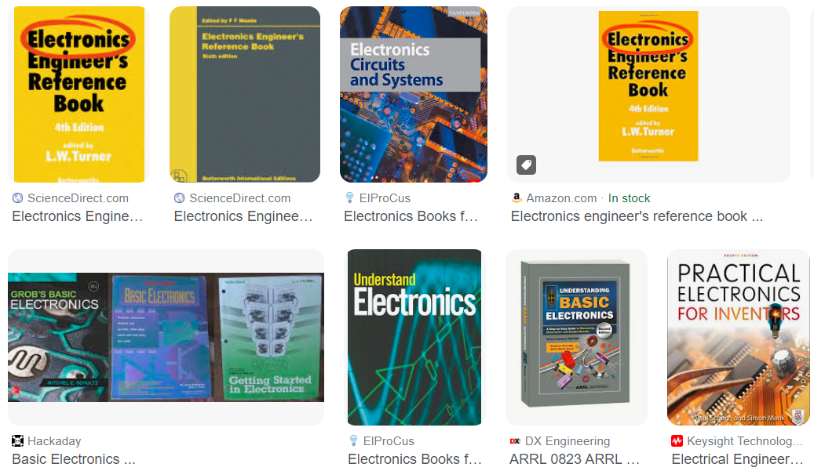

# Useful_References
Useful references for Electronics, Embedded Systems, Computer Engineering, and more ...

  

# Electronics - PCB Design - Hardware
| # | Reference Title | Author(s) | Link | Recommended By |
| - | --------------- | --------- | ---- | -------------- |
| 1 | The Art of Electronics | Paul Horowitz, Winfield Hill | [Link](https://www.amazon.com/Art-Electronics-Paul-Horowitz/dp/0521809266) | - |
| 2 | The Art of Electronics: The x Chapters | Paul Horowitz, Winfield Hill | [Link](https://www.amazon.com/Art-Electronics-x-Chapters/dp/1108499945) | - |
| 3 | Practical Electronics for Inventors | by Paul Scherz , Simon Monk | [Link](https://www.amazon.com/Practical-Electronics-Inventors-Fourth-Scherz/dp/1259587541) | - |
| 4 | Open Circuits: The Inner Beauty of Electronic Components | Windell Oskay, Eric Schlaepfer | [Link](https://www.amazon.com/Open-Circuits-Beauty-Electronic-Components/dp/1718502346) | [Link](https://opencircuitsbook.com/) |
| 5 | EMC at Component and PCB Level | Martin O 'Hara | [Link](https://www.elsevier.com/books/emc-at-component-and-pcb-level/o-hara/978-0-7506-3355-0) | - |
| 6 | Teach Yourself Electricity and Electronics | Stan Gibilisco, Simon Monk | [Link](https://www.amazon.com/Teach-Yourself-Electricity-Electronics-Sixth/dp/1259585530) | - |
| 7 | Bird's Electrical and Electronic Principles and Technology | John Bird | [Link](https://www.amazon.com/Birds-Electrical-Electronic-Principles-Technology-ebook/dp/B0933L77ZD) | - |
| 8 | The Circuit Designer's Companion | Peter Wilson | [Link](https://www.amazon.com/Circuit-Designers-Companion-Peter-Wilson/dp/0080971385) | - |
| 9 | PCB Design for Real-World EMI Control | Bruce R. Archambeault, James Drewniak | [Link](https://www.amazon.com/Real-World-Springer-International-Engineering-Computer/dp/1402071302) | - |
| 10 | Electromagnetic Compatibility Engineering | Henry W. Ott | [Link](https://www.amazon.com/Electromagnetic-Compatibility-Engineering-Henry-Ott/dp/0470189304) | - |
| 11 | Electronic Devices | Thomas L. Floyd | [Link](https://www.amazon.com/Electronic-Devices-Thomas-L-Floyd/dp/1292222999) | - |
| 12 | GROB’S BASIC ELECTRONICS | Mitchel Schultz | [Link](https://www.amazon.com/s/ref=dp_byline_sr_book_1?ie=UTF8&field-author=Mitchel+Schultz&text=Mitchel+Schultz&sort=relevancerank&search-alias=books) | [Hackaday](https://hackaday.com/2016/08/19/books-you-should-read-basic-electronics/) |

# Reverse Engineering - hardware Hacking
| # | Reference Title | Author(s) | Link | Recommended By |
| - | --------------- | --------- | ---- | -------------- |
| 1 | The Art of PCB Reverse Engineering (Standard Edition): Unravelling the Beauty of the Original Design | Mr Keng Tiong Ng | [Link](https://www.amazon.com/gp/product/151880053X/) | - |

# High Speed Digital Design
| # | Reference Title | Author(s) | Link | Recommended By |
| - | --------------- | --------- | ---- | -------------- |
| 1 | The VNA Applications Handbook  | Gregory Bonaguide, Neil Jarvis  | [Link](https://books.google.com.eg/books?id=_VyzDwAAQBAJ&lpg=PA152&dq=The%20VNA%20Applications%20Handbook&pg=PP1#v=onepage&q=The%20VNA%20Applications%20Handbook&f=false) | [Video](https://www.youtube.com/watch?v=G4eLcTC4Ako) |

# Power Electronics - SMPS - DC-DC Converters
| # | Reference Title | Author(s) | Link | Recommended By |
| - | --------------- | --------- | ---- | -------------- |
| 1 | Power Electronics Step-by-Step: Design, Modeling, Simulation, and Control | Weidong Xiao | [Link](https://books.google.com.eg/books?id=b00TEAAAQBAJ) | [Link](https://www.youtube.com/watch?v=k9tx88upmdU) |

# Embedded Systems
| # | Reference Title | Author(s) | Link | Recommended By |
| - | --------------- | --------- | ---- | -------------- |
| 1 | Reusable Firmware Development | Jacob Beningo | [Link](https://www.amazon.com/Reusable-Firmware-Development-Practical-Approach/dp/1484232968) | - |

# RF
| # | Reference Title | Author(s) | Link | Recommended By |
| - | --------------- | --------- | ---- | -------------- |
| 1 | RF Microelectronics | Behzad Razavi  | [Link](https://www.amazon.com/Microelectronics-Communications-Engineering-Technologies-Rappaport/dp/0137134738) | - |